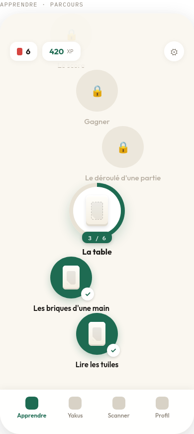
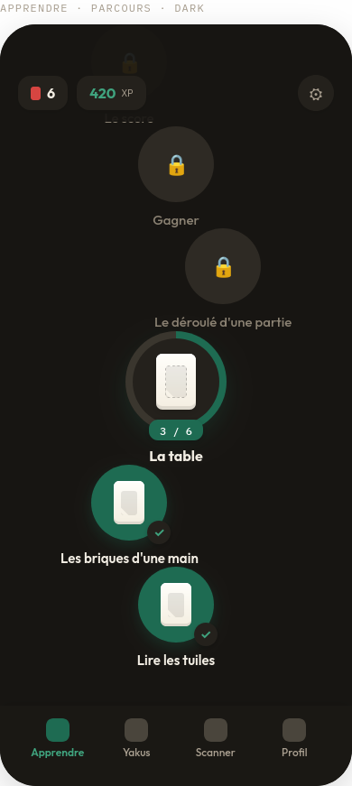
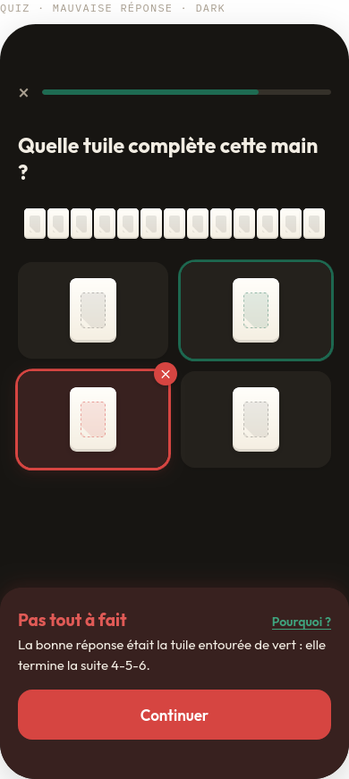
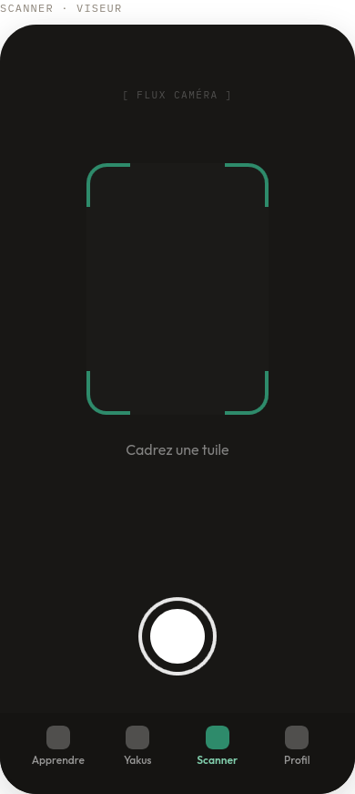
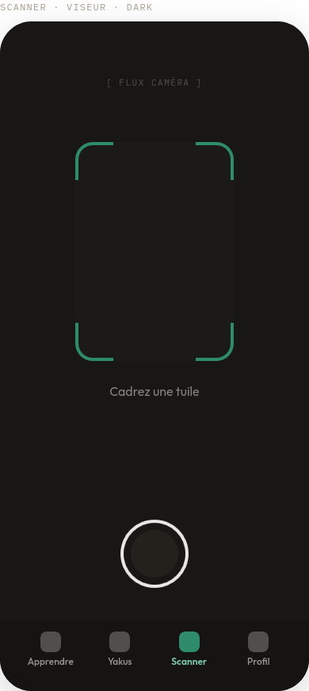

# Tenpai

<!-- AI-GENERATED by Claude (Claude Code), 2026-09-17 -->
<!-- Why: Project tooling and setup so study time goes to Flutter code. -->

Tenpai teaches complete beginners Japanese Riichi Mahjong on Android,
Duolingo-style: short lessons, a progression path, and immediate feedback. It
is a school project whose real deliverable is the author learning Flutter —
working code is the byproduct, and the lesson path is the only feature that
matters to the product. AI (Claude, via Claude Code) is used as a tutor and
reviewer, never as the implementer of `lib/`; see [CLAUDE.md](CLAUDE.md) and
[docs/AI_CONTRIBUTIONS.md](docs/AI_CONTRIBUTIONS.md) for exactly what it
touched and why.

## Screenshots

The design handoff (`design/handoff/`) ships 36 reference captures at
390×844, light and dark, covering all 18 screens.

| Screen | Light | Dark |
|---|---|---|
| Learning path |  |  |
| Quiz — wrong answer + Sensei |  |  |
| Scanner viewfinder |  |  |

## Features

- **Lesson path** — six units of short, illustrated lessons with immediate
  feedback: Lire les tuiles, Les briques d'une main, La table, Le déroulé
  d'une partie, Gagner, Le score.
- **Yaku Dex** — a browsable catalog of scoring hands (yaku), served from a
  hosted JSON REST API. No public API for Riichi yaku exists, so the catalog
  is authored by hand and hosted as a static JSON file; the app fetches it
  over HTTP like any other REST endpoint (base URL injected, never
  hard-coded).
- **Tile scanner** — point the camera at a tile for a single-shot photo, and
  see the matching tile card.
- **Account and progress sync** — email/password or Google sign-in, with
  streaks, XP, and lesson progress kept in Cloud Firestore; its offline
  persistence queues changes made without a network and replays them on
  reconnect. Settings, the cached yaku catalog and scan history stay on the
  device in Isar.
- **Sensei** — a patient AI explanation offered after a wrong quiz answer,
  shown in a dedicated panel (seal `先`) that never blocks the quiz; it
  covers loading, streaming, error, and offline states gracefully.
- **Light and dark mode** — a full theme pair (warm, non-pure-black dark
  background; tile faces stay ivory in both).

## Tech stack

Flutter 3.47 / Dart 3.13, targeting Android only. Declared in
`pubspec.yaml` unless marked planned:

- `material_ui` / `cupertino_ui` — Material moved out of the Flutter
  framework in 3.47; the app imports `package:material_ui/material_ui.dart`,
  never `package:flutter/material.dart`.
- `flutter_riverpod` for state, `go_router` for navigation, `freezed` +
  `json_serializable` for models and DTOs, `dio` for HTTP.
- Outfit (400–700) and IBM Plex Mono (400–500) bundled as static TTFs under
  `assets/fonts/`, no `google_fonts`.
- `flutter_svg` (planned) for tile art.
- `image_picker` (planned) for the tile scanner.
- Isar (planned, `isar_community` fork) as the on-device database for
  local-only data: settings, cached yaku catalog, scan history. The
  original `isar` package has not been published since 2023.
- `firebase_core`, `firebase_auth`, `cloud_firestore` (planned) for
  authentication and progress, with Firestore's built-in offline
  persistence doing the synchronisation.
- `firebase_ai` with `firebase_app_check` (planned) to run the Sensei
  explanation through Firebase AI Logic, so no API key ships in the app and
  only the genuine app can call it.

## Getting started

Prerequisites: Flutter 3.47+ / Dart 3.13+ (pinned in `pubspec.yaml`:
`sdk: ^3.13.3`), an Android device or emulator. No iOS/web/desktop tooling
is needed or supported.

```bash
flutter pub get
dart run build_runner build -d   # regenerates *.g.dart / *.freezed.dart
flutter run                      # -d <android-device-id> to target a device
```

No `--dart-define` values are required.

### Develop

```bash
flutter analyze                       # lints, incl. riverpod_lint plugin
flutter test                          # all tests
dart run tool/check_conventions.dart  # naming/privacy checks lints can't do
```

## AI usage

AI (Claude, via Claude Code) acts as tutor and reviewer on this project,
marking every file or block it writes with an `AI-GENERATED` header or a
matching `AI-GENERATED (Claude) BEGIN` / `END` comment pair. The full
register of marked paths, dates, and reasons is
[docs/AI_CONTRIBUTIONS.md](docs/AI_CONTRIBUTIONS.md), validated by
`dart run tool/check_conventions.dart`.
</content>
